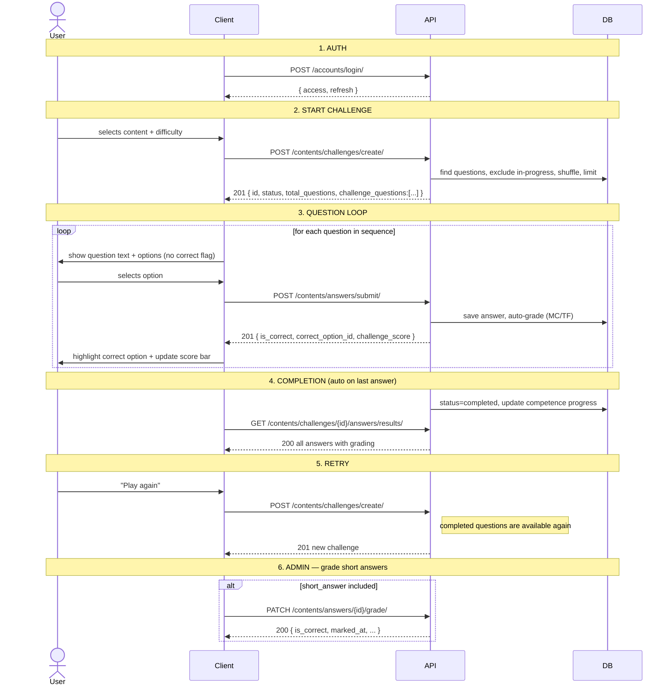

# Challenges Frontend Integration Guide

A step-by-step guide for frontend developers implementing the quiz/challenge flow.

---

## Sequence Diagram



---

## 1. Auth

All endpoints require a JWT `Bearer` token. Obtain one at login:

**Request**
```http
POST /accounts/login/
Content-Type: application/json

{
  "email": "user@example.com",
  "password": "yourpassword"
}
```

**Response**
```json
{
  "access": "eyJhbGciOiJIUzI1NiIsInR5cCI6IkpXVCJ9...",
  "refresh": "eyJhbGciOiJIUzI1NiIsInR5cCI6IkpXVCJ9...",
  "id": 1,
  "username": "alice",
  "email": "user@example.com",
  "first_name": "Alice",
  "last_name": "Smith"
}
```

**Store both the token and the user ID** — you will need `id` when creating a challenge:

```js
const { access, refresh, id: userId } = await loginResponse.json();
// Store access, refresh, and userId in your app state / localStorage
```

Attach the token to every subsequent request:
```http
Authorization: Bearer <access>
```

The `access` token expires — use `POST /accounts/token/refresh/` with `{ "refresh": "..." }` to get a new one.

---

## 2. Starting a Challenge

A challenge is a session that ties a user to a set of questions. You must specify at least one of `content_id` or `capacity_id`.

**Request**
```http
POST /contents/challenges/create/
Authorization: Bearer <token>
Content-Type: application/json

{
  "user": 1,
  "content_id": 5,
  "difficulty": ["medium", "hard"],
  "count": 5
}
```

> **`user`** is the numeric `id` returned by `POST /accounts/login/`. Store it at login and pass it here — the backend does not infer it from the JWT token.

| Field | Required | Description |
|---|---|---|
| `user` | Yes | User ID — the `id` field from the login response |
| `content_id` | One of these | Pull questions from this content |
| `capacity_id` | One of these | Pull questions for this competence |
| `difficulty` | No | `["easy"]`, `["medium", "hard"]`, or omit for all |
| `count` | No | Max questions to include; omit for all matching |

**Response — 201 Created**
```json
{
  "id": 12,
  "user": 1,
  "user_name": "alice",
  "organization_level": 3,
  "status": "pending",
  "started_at": null,
  "ended_at": null,
  "total_questions": 5,
  "answered_questions": 0,
  "score": {
    "correct": 0,
    "total_graded": 0,
    "percentage": null
  },
  "challenge_questions": [
    {
      "id": 31,
      "sequence": 1,
      "points_allocated": null,
      "question": {
        "id": 14,
        "text": "What is the primary goal of financial management?",
        "question_type": "multiple_choice",
        "difficulty": "medium",
        "difficulty_level": 5,
        "options": [
          { "id": 51, "text": "Maximize shareholder value", "sequence": 1 },
          { "id": 52, "text": "Minimize employee costs",    "sequence": 2 },
          { "id": 53, "text": "Increase product inventory", "sequence": 3 },
          { "id": 54, "text": "Reduce operational risk",    "sequence": 4 }
        ]
      }
    }
  ],
  "created_at": "2026-04-05T10:00:00Z",
  "updated_at": "2026-04-05T10:00:00Z"
}
```

**Error — 400** if no matching questions exist:
```json
{
  "non_field_errors": [
    "No new questions found matching the given criteria. The user may have already answered all available questions."
  ]
}
```

---

## 3. Rendering Questions

Parse `challenge_questions` and sort by `sequence`. For each item, display:
- `question.text` — the question prompt
- `question.options[]` — the answer choices (`id`, `text`)

**Important:** options never include an `is_correct` flag before the user answers. Do not try to pre-highlight anything — that data is intentionally absent.

```js
const questions = challenge.challenge_questions
  .sort((a, b) => a.sequence - b.sequence)
  .map(cq => cq.question);

// Display question N
const q = questions[currentIndex];
// q.id, q.text, q.options[].id, q.options[].text
```

---

## 4. Submitting an Answer

Submit one answer at a time. The response immediately tells you whether the answer was correct.

**Request — multiple_choice / true_false**
```http
POST /contents/answers/submit/
Authorization: Bearer <token>
Content-Type: application/json

{
  "challenge": 12,
  "question": 14,
  "selected_option": 52
}
```

**Request — short_answer**
```http
POST /contents/answers/submit/
Authorization: Bearer <token>
Content-Type: application/json

{
  "challenge": 12,
  "question": 15,
  "answer_text": "To allocate resources efficiently and maximise returns."
}
```

**Response — 201 Created (multiple_choice / true_false)**
```json
{
  "id": 7,
  "challenge": 12,
  "question": 14,
  "question_text": "What is the primary goal of financial management?",
  "selected_option": 52,
  "selected_option_text": "Minimize employee costs",
  "answer_text": null,
  "is_correct": false,
  "marked_at": "2026-04-05T14:23:01Z",
  "submitted_at": "2026-04-05T14:23:01Z",
  "correct_option_id": 51,
  "challenge_score": {
    "correct": 1,
    "total_answered": 3,
    "total_graded": 3,
    "percentage": 33.3
  }
}
```

**Response — 201 Created (short_answer)**
```json
{
  "id": 8,
  "challenge": 12,
  "question": 15,
  "question_text": "Explain the concept of opportunity cost.",
  "selected_option": null,
  "selected_option_text": null,
  "answer_text": "To allocate resources efficiently and maximise returns.",
  "is_correct": null,
  "marked_at": null,
  "submitted_at": "2026-04-05T14:24:00Z",
  "correct_option_id": null,
  "challenge_score": {
    "correct": 1,
    "total_answered": 4,
    "total_graded": 3,
    "percentage": 33.3
  }
}
```

`is_correct: null` means the answer is pending admin review — see [Section 10](#10-short-answer-flow).

---

## 5. Showing Feedback

After each submit response:

1. **Highlight the correct option** using `correct_option_id`
2. **Mark the user's choice** as correct or incorrect using `is_correct`
3. **Update the score bar** using `challenge_score`

```js
const { is_correct, correct_option_id, challenge_score } = submitResponse;

// Mark options
options.forEach(opt => {
  if (opt.id === correct_option_id) opt.highlight = 'correct';
  else if (opt.id === selectedOptionId && !is_correct) opt.highlight = 'wrong';
});

// Update score display
scoreBar.update(challenge_score.correct, challenge_score.total_answered);
// e.g. "1 / 3 correct (33.3%)"
```

---

## 6. Detecting Challenge Completion

The challenge transitions to `completed` automatically when the last question is answered. You don't need to call a separate endpoint to close it.

Detect completion client-side:

```js
const isComplete =
  challenge_score.total_answered === challenge.total_questions;

if (isComplete) {
  showFinalScreen(challenge_score);
  fetchAllResults(challenge.id);
}
```

Or inspect the challenge status after the last submit via `GET /contents/challenges/<id>/`.

---

## 7. Fetching Final Results

After the challenge is complete, retrieve grading for all answers in one call:

**Request**
```http
GET /contents/challenges/12/answers/results/
Authorization: Bearer <token>
```

**Response — 200 OK (challenge completed)**
```json
[
  {
    "id": 7,
    "challenge": 12,
    "question": 14,
    "question_text": "What is the primary goal of financial management?",
    "selected_option": 52,
    "selected_option_text": "Minimize employee costs",
    "answer_text": null,
    "is_correct": false,
    "submitted_at": "2026-04-05T14:23:01Z",
    "marked_at": "2026-04-05T14:23:01Z"
  },
  {
    "id": 8,
    "challenge": 12,
    "question": 15,
    "question_text": "Explain the concept of opportunity cost.",
    "selected_option": null,
    "selected_option_text": null,
    "answer_text": "To allocate resources efficiently and maximise returns.",
    "is_correct": true,
    "submitted_at": "2026-04-05T14:24:00Z",
    "marked_at": "2026-04-05T14:30:00Z"
  }
]
```

**Response — 202 Accepted (challenge still in progress)**
```json
{
  "warning": "Challenge is not yet completed. Results may be partial.",
  "results": [...]
}
```

Use `202` to inform the user that not all results are final yet.

---

## 8. Retrying

Once a challenge is `completed`, its questions become available again for new challenges. Just create a new challenge with the same parameters:

```http
POST /contents/challenges/create/
Authorization: Bearer <token>
Content-Type: application/json

{
  "user": 1,
  "content_id": 5,
  "difficulty": ["medium", "hard"],
  "count": 5
}
```

The deduplication logic only blocks questions that are part of a currently `pending` or `active` challenge. Completed challenge questions are reshuffled and available for retakes.

---

## 9. Error Handling

| HTTP Code | When it happens | What to show |
|---|---|---|
| `201` | Answer submitted / challenge created | Proceed normally |
| `202` | Fetching results before challenge completes | "Results are partial — come back when finished" |
| `400` | Validation error | Display `non_field_errors` or field errors to user |
| `400` | No questions found for the criteria | "No questions available for this content/difficulty" |
| `400` | Question not in this challenge | Internal error — log it |
| `400` | Challenge already completed | Internal error — stop submitting |
| `401` | Missing or expired token | Redirect to login / refresh token |
| `403` | Non-admin trying to grade | Hide grading UI from non-admin users |
| `404` | Challenge or answer not found | Show "not found" screen |

---

## 10. Short Answer Flow

Short answer questions (`question_type: "short_answer"`) are not auto-graded. The submit response returns `is_correct: null`.

**Submit**
```http
POST /contents/answers/submit/
{
  "challenge": 12,
  "question": 15,
  "answer_text": "The cost of the next best alternative foregone."
}
```

**Immediate response**
```json
{
  "is_correct": null,
  "marked_at": null,
  ...
}
```

**Poll for grading** (or subscribe via webhook if available):
```http
GET /contents/answers/8/result/
```

Returns `202` if not yet graded:
```json
{ "detail": "Answer has not been graded yet." }
```

Returns `200` once graded:
```json
{
  "id": 8,
  "is_correct": true,
  "marked_at": "2026-04-05T15:00:00Z",
  ...
}
```

**Admin grading** (`staff` token required):
```http
PATCH /contents/answers/8/grade/
Authorization: Bearer <admin_token>
Content-Type: application/json

{ "is_correct": true }
```

**Response — 200 OK**
```json
{
  "id": 8,
  "challenge": 12,
  "question": 15,
  "question_text": "Explain the concept of opportunity cost.",
  "selected_option": null,
  "selected_option_text": null,
  "answer_text": "The cost of the next best alternative foregone.",
  "is_correct": true,
  "submitted_at": "2026-04-05T14:24:00Z",
  "marked_at": "2026-04-05T15:00:00Z"
}
```

Once all short answers are graded, the challenge score and competence progress will be fully accurate.

---

## Full Integration Example (JavaScript)

```js
const BASE = 'http://localhost:8000';
let token;

// 1. Auth — store both the JWT token and the user ID
let userId;
async function login(email, password) {
  const res = await fetch(`${BASE}/accounts/login/`, {
    method: 'POST',
    headers: { 'Content-Type': 'application/json' },
    body: JSON.stringify({ email, password }),
  });
  const data = await res.json();
  token = data.access;
  userId = data.id;  // required when creating challenges
}

function authHeaders() {
  return { 'Content-Type': 'application/json', Authorization: `Bearer ${token}` };
}

// 2. Start challenge
async function startChallenge(userId, contentId, difficulty, count) {
  const res = await fetch(`${BASE}/contents/challenges/create/`, {
    method: 'POST',
    headers: authHeaders(),
    body: JSON.stringify({ user: userId, content_id: contentId, difficulty, count }),
  });
  if (!res.ok) throw await res.json();
  return res.json(); // challenge object with challenge_questions
}

// 3. Submit answer
async function submitAnswer(challengeId, questionId, selectedOptionId) {
  const res = await fetch(`${BASE}/contents/answers/submit/`, {
    method: 'POST',
    headers: authHeaders(),
    body: JSON.stringify({
      challenge: challengeId,
      question: questionId,
      selected_option: selectedOptionId,
    }),
  });
  return res.json();
  // { is_correct, correct_option_id, challenge_score: { correct, total_answered, percentage } }
}

// 7. Fetch all results
async function getChallengeResults(challengeId) {
  const res = await fetch(`${BASE}/contents/challenges/${challengeId}/answers/results/`, {
    headers: authHeaders(),
  });
  if (res.status === 202) {
    const data = await res.json();
    console.warn('Partial results:', data.warning);
    return data.results;
  }
  return res.json();
}

// Full quiz loop — userId comes from login()
async function runQuiz(contentId) {
  const challenge = await startChallenge(userId, contentId, ['medium', 'hard'], 5);
  const questions = challenge.challenge_questions.sort((a, b) => a.sequence - b.sequence);

  for (const cq of questions) {
    const { question } = cq;
    const selectedOptionId = await promptUser(question); // your UI

    const result = await submitAnswer(challenge.id, question.id, selectedOptionId);
    showFeedback(result.is_correct, result.correct_option_id, result.challenge_score);

    if (result.challenge_score.total_answered === challenge.total_questions) {
      const allResults = await getChallengeResults(challenge.id);
      showFinalScore(allResults);
      break;
    }
  }
}
```
